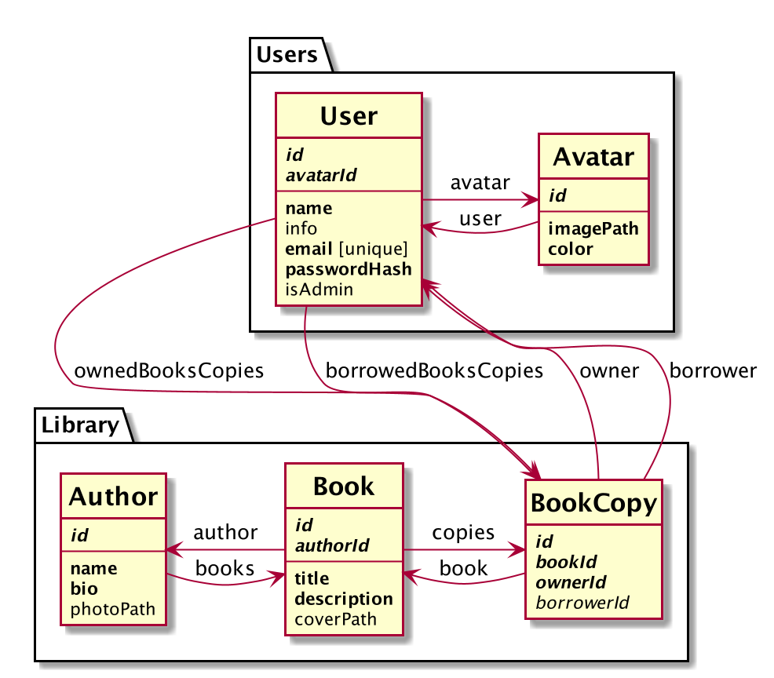

# The library

## Prerequisites

1. Install Node.js version 18.15.0.
2. Running PostgreSQL on port `5432`.
3. Create `graphql_development` database with current user access.

```
psql --host localhost --port 5432 --user postgres
CREATE DATABASE graphql_development;
```

## Installation and running

1. `yarn install`
2. `yarn build`
3. `yarn dev` - will run express dev server along with webpack.

Navigate to http://localhost:8080/ to see the app.

Navigate to http://localhost:4000/ to see GraphQL Playground.

## Database


